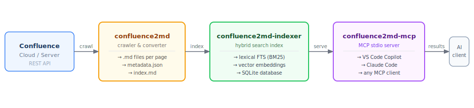

# The `confluence2md` Platform

Three tools that together form a complete local Confluence knowledge pipeline — from raw pages to AI-queryable search.

## Overview

| Tool | Role |
|------|------|
| [`confluence2md`](https://github.com/gkoos/confluence2md) | Crawls Confluence and exports pages as local Markdown files |
| [`confluence2md-indexer`](https://github.com/gkoos/confluence2md-indexer) | Indexes the Markdown export into a searchable SQLite database |
| [`confluence2md-mcp`](https://github.com/gkoos/confluence2md-mcp) | Exposes the index to AI clients via the Model Context Protocol |

## Architecture



## Data Flow

### 1. Crawl — `confluence2md`

Authenticates to Confluence via the REST API, fetches pages and attachments, converts HTML to Markdown, and writes one `.md` file per page with stable filenames and deterministic YAML front matter. Produces a `metadata.json` link graph and an `index.md` start page.

### 2. Index — `confluence2md-indexer`

Reads the Markdown output directory, chunks each page, computes vector embeddings, builds FTS tables, and stores everything in a single local SQLite file. Supports lexical (BM25), vector (cosine), and hybrid retrieval. Can also be used as a Go library via its public `Query` API.

### 3. Serve — `confluence2md-mcp`

Wraps `confluence2md-indexer` as a stdio MCP server. Receives search queries from any MCP-compatible AI client (VS Code Copilot, Claude Code, OpenAI Codex, etc.), queries the SQLite index with hybrid retrieval, and returns ranked results with score metadata.

## Quick Start

```bash
# 1. Crawl your Confluence space
confluence2md --config config.yaml

# 2. Build the search index
confluence2md-indexer index ./output

# 3. Configure your AI client to use the MCP server
#    (see confluence2md-mcp README for VS Code / Claude Code setup)
```

## Repository Links

- [confluence2md](https://github.com/gkoos/confluence2md) — crawler and converter
- [confluence2md-indexer](https://github.com/gkoos/confluence2md-indexer) — hybrid search indexer
- [confluence2md-mcp](https://github.com/gkoos/confluence2md-mcp) — MCP server for AI clients
