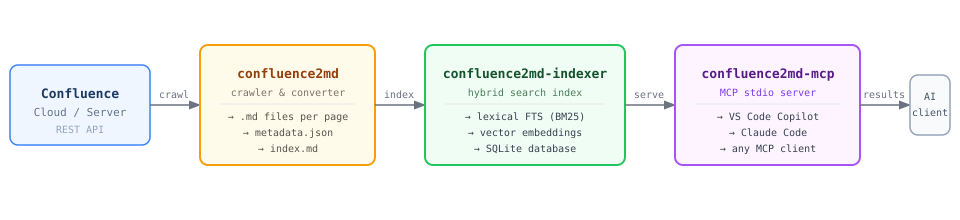

# The `confluence2md` Platform

Three tools that together form a complete local Confluence knowledge pipeline — from raw pages to AI-queryable search.

## Overview

| Tool | Role |
|------|------|
| [`confluence2md`](https://github.com/gkoos/confluence2md) | Crawls Confluence and exports pages as local Markdown files |
| [`confluence2md-indexer`](https://github.com/gkoos/confluence2md-indexer) | Indexes the Markdown export into a searchable SQLite database |
| [`confluence2md-mcp`](https://github.com/gkoos/confluence2md-mcp) | Serves the index to AI clients through two MCP tools, `confluence.search` and `confluence.list_spaces` |

## Architecture



## Data Flow

### 1. Crawl — `confluence2md`

Authenticates to Confluence via the REST API, fetches pages and attachments, converts HTML to Markdown, and writes one `.md` file per page with stable filenames and deterministic YAML front matter. Produces a `metadata.json` link graph and an `index.md` start page.

### 2. Index — `confluence2md-indexer`

Reads the Markdown output directory, chunks each page, computes vector embeddings, builds FTS tables, and stores everything in a single local SQLite file. Supports lexical (BM25), vector (cosine), and hybrid retrieval. Can also be used as a Go library via its public `Query` API.

### 3. Serve — `confluence2md-mcp`

Wraps `confluence2md-indexer` as a stdio MCP server and exposes two tools to any MCP-compatible AI client (VS Code Copilot, Claude Code, OpenAI Codex, etc.):

| Tool | Returns |
|------|---------|
| `confluence.search` | Ranked chunks with score metadata, narrowed by the metadata filters (`spaceKey`, `spaces`, `host`, `author`, `createdBy`, `modifiedBy`, `pageId`, `fromDate`/`toDate`, `depthMin`/`depthMax`, `seedOnly`, `hasAttachments`, `updatedSince`) and by per-call embedding overrides. |
| `confluence.list_spaces` | The space keys the index holds, so a client can scope a search without knowing them in advance. |

The server reads the index built by the same indexer release; an index from an older release is not migrated, so rebuild it once (`confluence2md-indexer index <folder> --rebuild`). It resolves its embedding provider from `CONFLUENCE2MD_EMBEDDING_*` variables, so it must resolve the same identity the index was built with — a mismatch is reported as an actionable error instead of degrading silently to text-only scores, and `mode: "lexical"` works without any embedding configuration.

## Quick Start

```bash
# 1. Crawl your Confluence space
confluence2md --config config.yaml

# 2. Build the search index
confluence2md-indexer index ./output

# 3. Point the MCP server at the index and configure your AI client
#    CONFLUENCE_INDEX_DB=/absolute/path/to/confluence2md-index.db
#    (see confluence2md-mcp README for VS Code / Claude Code setup)
```

## Repository Links

- [confluence2md](https://github.com/gkoos/confluence2md) — crawler and converter
- [confluence2md-indexer](https://github.com/gkoos/confluence2md-indexer) — hybrid search indexer
- [confluence2md-mcp](https://github.com/gkoos/confluence2md-mcp) — MCP server for AI clients
